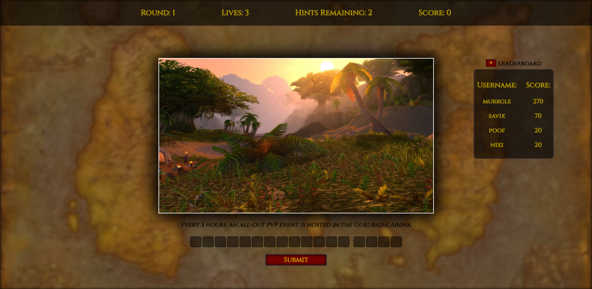

# World of Warcraft Geoguesser Game

*[Link to Live Site](https://tranquil-waters-11123.herokuapp.com/)*

Welcome to the World of Warcraft Geoguesser game! In this game, users are presented with an in-game screenshot and must guess the name of the zone it was taken in. You have 3 lives and 3 hints to help you along the way. Every incorrect guess subtracts a life.

At the end of the game, you have the option to save your score to the leaderboard. Your score will be updated in the database if you play under the same username.

## Screenshot

## Technologies Used
- JavaScript
- Express
- Node.js
- MySQL

## Video
*[Click here to watch a demo](https://www.awesomescreenshot.com/video/17033580?key=71927cc2c3f4a6c8615ffd9b1ccb47b2)*
